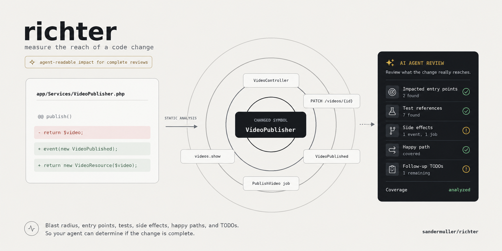

# Richter

[](https://packagist.org/packages/sandermuller/richter)
[](https://github.com/SanderMuller/richter/actions/workflows/run-tests.yml)
[](https://github.com/SanderMuller/richter/actions/workflows/phpstan.yml)
[](https://packagist.org/packages/sandermuller/richter)
[](LICENSE)
[](https://packagist.org/packages/sandermuller/richter)

Measures the magnitude of impact of code changes in a Laravel codebase. Like the Richter scale, but for your PHP.

Built on [Laravel Brain](https://github.com/laramint/laravel-brain)'s static analysis, Richter constructs a directed code graph of your application (routes, controllers, jobs, listeners, policies, resources, Blade views, Eloquent relations). It reads two things off that graph:

- **The blast radius of a symbol:** its callers (what breaks if you change it) and its dependencies (what it reaches).
- **What the current branch diff touches:** the HTTP/CLI entry points and flows the changed files reach, plus a coarse risk level.

You can use those results three ways:

- **CLI:** a self-review aid before you push.
- **MCP:** Richter registers a local `richter` server exposing both analyses read-only, so a coding agent can check a symbol's blast radius or triage the branch diff mid-review without shelling out.
- **CI and PR review:** run `richter:detect-changes` against the pull request's base ref and post the report for the reviewer, human or agent.

Richter is advisory by default: `richter:detect-changes` exits 0, and a low or empty result is a signal, not a guarantee of no impact. Opt into a CI gate with `--fail-on` / `--fail-on-unresolved` when you want a non-zero exit (see [Gating in CI](#gating-in-ci)).

## What it's for

Richter shows what a change reaches, before you or your reviewer have to guess.

- **Catch what you missed, before review.** Run `richter:detect-changes` on your branch and read the entry points and flows the diff reaches. Anything you didn't expect it to touch is worth a look before you open the PR.
- **Turn reach into a test-coverage prompt.** Every reached entry point is tagged `[test-referenced]` or `[⚠ no test references this]`. An entry point whose behaviour you changed with nothing referencing it is a place to add a test; the tag flags a missing reference, not proof the code is untested.
- **Hand the reviewer your blast radius.** Drop the report into the pull request description, or let a coding agent read it over MCP, so review starts from what the change reaches instead of a cold diff.
- **Size a refactor first.** Before you rename or rework a symbol, `richter:impact "App\Models\User"` lists its callers (what breaks if you change it) and its dependencies (what it reaches).

The analysis never executes your application's routes, jobs, or commands. It is static analysis over a code graph, fast enough to run on every branch. It does, however, autoload classes from the analyzed checkout (to resolve constants, relation names, and queue interfaces), and autoloading runs a file's top-level code. Treat a checkout you would not `composer install` on as one you should not analyze either.

## Coverage beyond Brain

Richter adds two things over Laravel Brain alone: the tooling above (CLI, MCP, and CI/PR review) and wider graph coverage. On coverage, it traces the edges a route-anchored analysis misses:

- queue dispatches, including unresolvable ones;
- `$listen`-registered event listeners;
- container bindings and interface implementations;
- policy references (`$user->can(PostPolicy::UPDATE, …)` and `@can(...)` in Blade);
- API resource composition;
- custom validation rules;
- trait usage;
- eager-load relation strings;
- view-to-view includes;
- frontend endpoint references — Wayfinder imports, Ziggy calls, endpoint literals in changed TS/JS/Vue files and Blade inline scripts (opt-in, see [Frontend changes](#frontend-changes-wayfinder--ziggy)).

## Installation

```bash
composer require --dev sandermuller/richter
```

Requires PHP 8.4+ and Laravel 12 or 13. Optionally publish the config:

```bash
php artisan vendor:publish --tag=richter-config
```

## Usage

### Blast radius of a symbol

```bash
php artisan richter:impact "App\Services\VideoPublisher"
php artisan richter:impact VideoPublisher                     # substrings work too
php artisan richter:impact "App\Services\VideoPublisher" --json       # machine-readable, for scripting
php artisan richter:impact "App\Services\VideoPublisher" --markdown   # PR-ready markdown
```

Prints the symbol's callers (what breaks if you change it) and its dependencies (what it reaches), breadth-first. Each hop shows its depth (`d1`, `d2`, …) and the edge it was reached through, so a caller chain reads back to the entry point one hop at a time:

```text
Callers (what breaks if you change "App\Services\VideoPublisher"):
  d1  App\Http\Controllers\VideoController::publish  (via action-to-service)  — app/Http/Controllers/VideoController.php
  d2  App\Http\Controllers\VideoController  (via controller-to-action)  — app/Http/Controllers/VideoController.php
  d3  route::POST::/videos/{video}/publish  (via route-to-controller)  — routes/web.php:24

Dependencies (what "App\Services\VideoPublisher" reaches):
  d1  App\Events\VideoPublished  (via action-to-event)  — app/Events/VideoPublished.php
```

Every hop carries its defining file (and line, when known), project-relative — no grepping to find what a report names.

With `--json`, stdout is a single document (`{target, callers, dependencies}`, each hop `{depth, node, via, file?, line?}`), or `{"error": "…"}` on failure.

### Advisory change impact of the current diff

```bash
php artisan richter:detect-changes                        # diffs against richter.default_base
php artisan richter:detect-changes --base=origin/develop
php artisan richter:detect-changes --explain              # show how each entry point reaches the change
php artisan richter:detect-changes --json                 # machine-readable, for scripting or CI
php artisan richter:detect-changes --markdown             # PR-ready markdown, for descriptions and comments
```

Resolves which class members the branch changed (member-level, not file-level: a one-method change seeds that method, not the whole class), walks the graph, and reports:

- the entry points the change can reach — routes, commands, jobs, listeners, middleware, and Livewire/Filament component classes (a Blade-mounted component or Filament resource/page/widget is a user-facing surface even without a `route::` node) — each tagged `[test-referenced]` or `[⚠ no test references this]`;
- findings in the changed source itself, such as an eager-load or relation string that names no relation on any model. A missing comma between two relation constants is the classic case: `Video::OWNER . User::PROFILE` concatenates to `ownerprofile`, a name Eloquent silently never resolves;
- a coarse risk level (`low` / `medium` / `high`);
- honest degradation: a change that cannot be placed in the graph reads **UNRESOLVED**, never as a falsely reassuring "no impact", and an unfollowable dispatch makes a queue job read "unknown", not "none".

```text
Changed files:
  app/Models/Video.php (4 graph nodes)
  app/Services/PlaylistImporter.php (0 graph nodes)  (coverage incomplete for this area — UNRESOLVED, not "no impact")

Entry points reached: 2 (some changed files are in an area not yet graphed — see UNRESOLVED above)
  - command::playlists:sync  (app/Console/Commands/SyncPlaylists.php)  [test-referenced]
  - route::PATCH::/api/videos/{video}  (routes/api.php:41)  [⚠ no test references this]  [authed]

Related models (association reach — context, not risk): 1
  - App\Models\Playlist

Findings (in the changed source itself):
  ! app/Models/Video.php: eager-load string 'ownerprofile': segment 'ownerprofile' is not a method on any model — check the relation name (a broken constant concatenation reads exactly like this)

Impacted nodes: 7
Risk: MEDIUM (advisory — not a gate)
```

With `--explain`, each reached entry point carries the shortest call chain down to the changed code. That is the difference between knowing a change reaches `PATCH /api/videos/{video}` and seeing exactly which controller and service carry it there:

```text
Entry points reached: 1
  - route::PATCH::/api/videos/{video}  [⚠ no test references this]
      ↳ route::PATCH::/api/videos/{video} →(route-to-controller) App\Http\Controllers\VideoController::update →(action-to-service) App\Services\VideoPublisher::publish
```

A self-listed entry class (a changed job or listener that *is* the entry surface rather than being reached from the change) deliberately carries no chain.

Reached routes also inherit [Laravel Brain](https://github.com/laramint/laravel-brain)'s security surface as advisory annotation: the exposure level renders inline (`[public]`, `[guest]`, `[authed]`, `[admin]`) and any statically detected issues render under the route:

```text
  - route::POST::/webhooks/payments  (routes/api.php:12)  [⚠ no test references this]  [public]
      ⚠ PUBLIC_WRITE (high): POST route with no auth middleware
```

This is annotation only — it never feeds the risk level or a `--fail-on` gate, it exists for routes only (Brain classifies nothing else), and false positives are suppressed where Brain's own config says so (`laravel-brain.security.trusted_route_names` / `trusted_route_uris`).

Pennant feature gating is annotated the same way. A route guarded by `EnsureFeaturesAreActive`
renders its flags inline (`[gated: ai-coach]`, a 🚩 badge in markdown, `entryPointGates` in JSON),
and a changed member or Blade view that itself checks a flag (`Feature::active(...)`, `@feature`)
notes it under Findings — a flag-gated change has a smaller live blast radius than the raw graph
suggests, and the reviewer should know. Route detection reads statically visible middleware
(a string alias like `'features:ai-coach'` or an FQCN-string form); the runtime-built
`EnsureFeaturesAreActive::using(...)` expression is invisible to static route parsing.

With `--markdown`, the report renders as GitHub-flavoured markdown: a risk badge up front, changed files as a table, entry points as a review checklist with their file:line, test tags and exposure badges, and long lists collapsed into `<details>` instead of truncated. The result is ready to paste into (or post onto) a pull request. `--markdown --explain` composes.

With `--json`, stdout is a single JSON document (the full, uncapped report) with these top-level keys, or `{"error": "…"}` if the diff can't be resolved:

| Key | Type | Meaning |
|---|---|---|
| `base` | string | the ref the diff was taken against |
| `changed` | object | `{file: graph-node count}` per changed file |
| `coverage` | object | `{file: "analyzed" \| "unresolved"}` per changed file |
| `entryPoints` | string[] | entry-point nodes the change reaches |
| `entryPointPaths` | object | per reached entry point, the shortest call chain down to the changed code as `{node, via, file?, line?}` hops; a self-listed entry class carries no chain |
| `entryPointLocations` | object | per entry point, its defining `{file, line?}` (project-relative), when known |
| `entryPointSecurity` | object | per reached route, Brain's security surface `{exposure, riskLevel, issues[]}` — advisory annotation, routes only, never an input to `risk` or the gate |
| `entryPointGates` | object | per reached route, the Pennant feature flags gating it — advisory annotation, never an input to `risk` or the gate |
| `impacted` | int | count of risk-bearing nodes reached |
| `relatedModels` | string[] | models reached only via association edges (context, not risk) |
| `risk` | string | `"low"` / `"medium"` / `"high"` |
| `lowConfidence` | bool | a changed member couldn't be pinned, so part of the estimate is coarse |
| `coarseCapApplied` | bool | a low-confidence `high` was capped to `medium` |
| `findings` | string[] | source-level findings, as shown above |
| `unresolved` | bool | any changed file is UNRESOLVED |
| `gate` | object | present only under a `--fail-on*` flag (see [Gating in CI](#gating-in-ci)) |

#### Risk levels

Risk is a coarse, advisory signal, deliberately simple so `--fail-on` stays predictable:

| Level | Condition |
|---|---|
| `high` | ≥ 3 entry points reached, **or** ≥ 20 impacted nodes |
| `medium` | ≥ 1 entry point reached, ≥ 5 impacted nodes, **or** the diff changes an entry-point class (job, listener, command, Livewire, observer, middleware) |
| `low` | everything else |

Association edges (model relationships, trait usage, `declares`) are reach and context, not risk. They never count toward the impacted-node total, so touching a hub model or trait can't saturate a change to `high` on breadth alone.

A separate guard covers low confidence. When a changed member can't be pinned to a graph node and only a coarse class-level seed is available, a resulting `high` is capped to `medium` (`coarseCapApplied`). A low-confidence estimate shouldn't drive the top level on its own.

### Gating in CI

`detect-changes` is advisory by default (exit 0). Two opt-in flags turn it into a gate:

- `--fail-on=<low|medium|high>` exits non-zero when the reported risk is at least that level (see [Risk levels](#risk-levels)).
- `--fail-on-unresolved` exits non-zero when any changed file is **UNRESOLVED** (changed code the graph can't place). It works independently of the risk threshold.

Either flag also fails an un-assessable diff (a broken or invalid base ref) rather than letting it pass as "no impact". Add `--json` and stdout carries a `gate` object alongside the report.

A pull-request check that surfaces the blast radius and fails on high-risk or unplaceable changes:

```yaml
name: Impact
on: pull_request

jobs:
  richter:
    runs-on: ubuntu-latest
    steps:
      - uses: actions/checkout@v4
        with:
          fetch-depth: 0   # detect-changes diffs against the base ref, so it must be in history
      - uses: shivammathur/setup-php@v2
        with:
          php-version: '8.4'
      - run: composer install --no-interaction --prefer-dist
      - run: cp .env.example .env && php artisan key:generate   # detect-changes boots the app to build the graph
      - run: php artisan richter:detect-changes --base=${{ github.event.pull_request.base.sha }} --fail-on=high --fail-on-unresolved
```

No GitHub Action ships with the package. `detect-changes` is a plain Artisan command, so wire it into whatever pipeline you already run.

> **Note:** `detect-changes` runs `php artisan`, so it boots your Laravel application to build the graph. The job needs whatever booting the app normally requires: typically an `.env` (`cp .env.example .env`) and an `APP_KEY` (`php artisan key:generate`), as above. Without them the command fails to boot before it can analyse anything.

The workflow analyzes the pull request's code, and analysis autoloads classes from that checkout (see above). For a public repository, keep the trigger on `pull_request` (never `pull_request_target` with a privileged token) so fork-submitted code runs without access to your secrets.

### Affected-test selection

```bash
php artisan richter:affected-tests                        # human-readable selection
php artisan richter:affected-tests --base=origin/develop
php artisan richter:affected-tests --json                 # {base, determinable, reasons, tests, frontendTests, unreferencedEntryPoints}
php artisan test $(php artisan richter:affected-tests --plain)   # simple form — coarse but safe
```

The simple form only ever errs toward running more: both an undetermined selection and a
determined-but-empty one leave `$(…)` empty, and an argument-less runner executes the full suite.
To also skip the run when the selection is determined and empty, branch on the exit code:

```bash
tests=$(php artisan richter:affected-tests --plain); status=$?
if [ "$status" -eq 0 ] && [ -z "$tests" ]; then echo "No affected tests."
elif [ "$status" -eq 0 ]; then php artisan test $tests
else php artisan test; fi   # exit 2: not determinable — full suite
```

Inverts the test-reference index into a selection: the test files that reference any entry point
the diff reaches, plus the tests that import any changed **or reached** class (a unit test of an
intermediate caller never touches an entry point). A `schedule::` entry resolves through the
command it runs. Only conventionally-named `*Test.php` files are selected — helpers and fixtures
under `tests/` never end up as runner arguments, and an entry point whose only references live in
a support trait blocks determination rather than silently dropping the tests using that trait.
Selection is reference-based recall, not proof of coverage — reached entry points nothing
references contribute nothing, and the report says how many those are.

It fails safe, and the exit code is the contract:

| Exit | Meaning |
|---|---|
| `0` | Selection determined (possibly empty). |
| `2` | **Not determinable — run the full suite.** Any UNRESOLVED file, low-confidence seed, unfollowable dispatch, or uncheckable entry point trips this; the reasons are printed (text) or carried in `reasons` (JSON). |
| `1` | Usage or unexpected error. |

In `--plain` mode an undeterminable run prints nothing, so the command-substitution form degrades
to the full suite by construction — as does a determined-but-empty selection, which is why the
exit-code branch above is the precise form.

### Frontend changes (Wayfinder / Ziggy)

Opt-in — point `frontend.roots` at your frontend source in `config/richter.php`:

```php
'frontend' => [
    'roots' => ['resources/js'],
],
```

Changed `.ts`/`.tsx`/`.js`/`.jsx`/`.vue` files are then scanned for the backend endpoints they
reference, and those routes are reported as touched entry points — with their location, exposure
and gate annotations, feeding `richter:affected-tests` — while `risk` and `impacted` stay
untouched: a frontend edit does not change backend behaviour, and the report says so explicitly.
Detected references:

- **[Wayfinder](https://github.com/laravel/wayfinder) imports** —
  `@/actions/App/Http/Controllers/VideoController` resolves through the router's action index
  (method-precise; aliased, default, invokable and `import type` forms included), and
  `@/routes/videos` route imports plus Ziggy `route('name')` calls resolve through the route
  names. Wayfinder's generated trees (`actions/`, `routes/`, `wayfinder/` under each root) are
  excluded as regeneration churn.
- **Endpoint strings**, matched against the app's route templates: plain literals
  (`axios.post('/videos')`) and backtick templates whose interpolations wildcard one segment
  (`` fetch(`/videos/${id}`) `` matches `/videos/{video}`). A verb-named call pins the HTTP
  method; anything unrecognisable stays method-agnostic and never narrows the match. Inline
  `<script>` blocks in changed Blade views get the same literal scan.

Frontend spec files (`*.test.*`, `*.spec.*`, `*.cy.*` under the roots, or `frontend.test_paths`)
referencing a touched route surface in `richter:affected-tests` as an advisory `frontendTests`
list for the JS runner — never in `--plain` (which feeds the PHP runner), and never a
determinability input.

The scan is regex-based and says so when it can't see: a dynamic `route(`…`)` argument or an
unmatched Wayfinder action import marks the file UNRESOLVED (and `richter:affected-tests` exits
`2`), while an unmatched `route('name')` string simply isn't a reference — `routes/` modules and
`route()` helpers collide with frontend-router idioms, so unmatched names never guess.

The bridge also runs in reverse, without any configuration: a changed backend member that
renders an Inertia page (`Inertia::render('Videos/Show')`, the `inertia()` helper) is noted
under Findings with the resolved page file under `frontend.pages_path` — or with an explicit
"no page file found" when the component doesn't resolve, which usually means a renamed or
deleted page.

### Scoring accuracy against replayable history

```bash
php artisan richter:benchmark
php artisan richter:benchmark --case=TICKET-123
php artisan richter:benchmark:add abc1234
php artisan richter:benchmark:add abc1234 --control
```

Replays historical fix commits (configured in `richter.benchmark_cases`) through the report: bug fixtures must resolve and reach an entry point; benign controls cap the risk a harmless change may report. Run it after changing the graph or tracers. A control flipping green→red is a regression in trustworthiness.

`richter:benchmark:add` scaffolds a case from a historical fix commit: it dry-runs the commit through the same replay, reports what it would score today, and prints a paste-ready `benchmark_cases` entry. It never edits the config file.

Each case in `config/richter.php`:

```php
'benchmark_cases' => [
    [
        'key' => 'TICKET-123',                 // label, and the --case selector
        'fix_commit' => 'abc1234',             // commit whose diff is replayed through the report
        'bug_class' => 'background-job change (data not copied on duplication)',
        'expect_signal' => true,               // bug fixture: must resolve and reach an entry point
        'max_risk' => 'high',                  // caps the risk a control (expect_signal: false) may report
    ],
],
```

### Graph cache

Building the code graph is the dominant cost of every command. Richter caches the built graph on disk (default: `storage/framework/cache/richter/graph.json`), keyed by a content fingerprint of everything the build reads: `app/`, `routes/`, `resources/views`, the relevant config, and the package versions. Any input change rebuilds automatically, so a hit can only ever serve the graph the current code produces; there is no TTL to tune and no stale window.

- The cache is on by default; set `richter.cache.enabled` to `false` to disable it.
- `--no-cache` (on every command) bypasses it for one run, the escape hatch for an input the fingerprint doesn't cover.
- A corrupt or mismatched cache file reads as a miss and is rebuilt; it never fails a run.

### MCP server

When [`laravel/mcp`](https://github.com/laravel/mcp) is installed, Richter registers a local MCP server named `richter` exposing two read-only tools: `impact` (blast radius of a symbol) and `detect-changes` (advisory impact of the current branch diff). A coding agent can then triage changes without shelling out to Artisan. Because the MCP session holds the graph cache in memory, repeated tool calls in one review don't rebuild the graph. Both tools also return MCP structured content in the same shape as the CLI `--json` output, so an agent can branch on fields instead of parsing prose. The supported range is `laravel/mcp` `^0.8||^0.9`; `composer.json` carries a matching `conflict` entry so an unvalidated release fails at resolution time rather than at boot.

Point Claude Code, Cursor, or any MCP client at the Artisan entry point, e.g. in `.mcp.json`:

```json
{
    "mcpServers": {
        "richter": {
            "command": "php",
            "args": ["artisan", "mcp:start", "richter"]
        }
    }
}
```

## Configuration

`config/richter.php`:

| Key | Default | Purpose |
|---|---|---|
| `default_base` | `origin/main` | Git ref `richter:detect-changes` diffs against when `--base` is omitted. |
| `dispatch_helpers` | `[]` | Project-custom global job-dispatch helper functions (e.g. `dispatch_with_retries`) the dispatch tracer should follow. |
| `entry_point_roots` | `Jobs`, `Listeners`, `Console/Commands`, `Filament`, `Helpers`, `Http/Middleware`, `Livewire`, `Observers` | Directories under `app/` traced as entry points beyond Brain's route-anchored graph (graph tracing only; the analyzer's risk-floor namespace heuristics are fixed). |
| `frontend.roots` | `[]` (off) | Frontend roots whose changed TS/JS/Vue files are scanned for Wayfinder/Ziggy endpoint references (see [Frontend changes](#frontend-changes-wayfinder--ziggy)). |
| `frontend.generated_paths` | `actions`, `routes`, `wayfinder` | Wayfinder's generated trees under each frontend root — excluded from scanning as regeneration churn. |
| `frontend.pages_path` | `resources/js/Pages` | Where Inertia page components live — a changed member rendering a page is noted under Findings with the resolved file. |
| `frontend.test_paths` | `[]` (the frontend roots) | Directories scanned for frontend spec files whose endpoint references feed `richter:affected-tests`' advisory `frontendTests` list. |
| `cache.enabled` | `true` | On-disk graph cache, keyed by a content fingerprint of the build inputs (see [Graph cache](#graph-cache)). |
| `cache.directory` | `null` | Cache location; `null` means `storage/framework/cache/richter`. |
| `benchmark_cases` | `[]` | Replayable accuracy fixtures for `richter:benchmark`. |

Filament coverage is class-level: resources, pages and widgets surface as entry points (and their
computed HTTP routes come in through Laravel Brain when Filament is installed), but individual
table/bulk actions are not modelled as separate entry points.

Richter assumes standard Laravel conventions: the `App\` root namespace, `app/Models`, `app/Policies`, `resources/views`, and `tests/`.

## Testing

```bash
composer test
```

## Changelog

See [CHANGELOG](CHANGELOG.md) for what changed per release.

## License

MIT. See [LICENSE](LICENSE).
