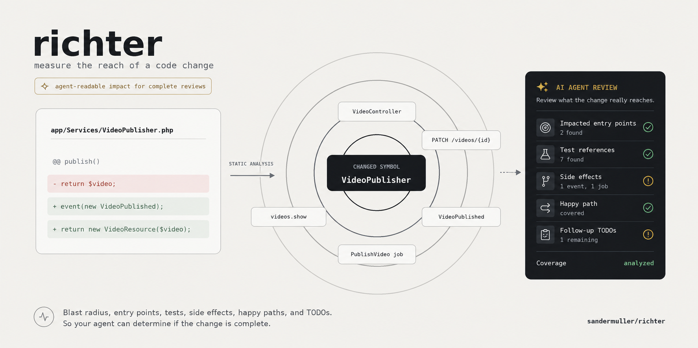

# Richter

[](https://packagist.org/packages/sandermuller/richter)
[](https://github.com/SanderMuller/richter/actions/workflows/run-tests.yml)
[](https://github.com/SanderMuller/richter/actions/workflows/phpstan.yml)
[](https://packagist.org/packages/sandermuller/richter)
[](LICENSE)
[](https://packagist.org/packages/sandermuller/richter)

Measures the magnitude of impact of code changes in a Laravel codebase. Like the Richter scale, but for your PHP.

Run `php artisan richter:detect-changes` on a branch and Richter reports the HTTP/CLI entry points the diff can reach, flags the ones no test references, and attaches a coarse advisory risk level, so review starts from what the change reaches instead of a cold diff. What makes it worth installing:

- **Member-level change impact.** A one-method change seeds that method in the code graph, not the whole class. The graph covers routes, controllers, jobs, listeners, policies, resources, Blade views, and Eloquent relations, plus [edges a route-anchored analysis misses](docs/coverage.md): static calls, facades, container bindings, config-keyed class registries, views rendered outside a route, constant reads, polymorphic overrides.
- **Honest degradation.** A change the graph can't place reads **UNRESOLVED**, never a falsely reassuring "no impact". A coverage gap costs reach, but it never causes anything to be reported as unaffected.
- **Test-coverage prompts.** Every reached entry point is tagged `[test-referenced]` or `[⚠ no test references this]`, a heuristic prompt rather than a coverage verdict ([tag details](docs/detect-changes.md#test-reference-tags)). An entry point whose behaviour you changed with nothing referencing it is a place to add a test.
- **Blast radius and traces on demand.** Before a refactor, `richter:impact` lists a symbol's callers (what breaks if you change it), its dependencies (what it reaches), and the entry surfaces behind those callers. `richter:trace` answers "how does this even reach that?" with the shortest call chain between two symbols.
- **Affected-test selection.** `richter:affected-tests` turns the diff's reach into a test selection, with an exit-code contract that fails toward running the full suite whenever the selection can't be trusted.
- **Built for coding agents.** Richter registers a local MCP server exposing every analysis read-only, so an agent can work with the graph mid-review without shelling out. The `--markdown` report is ready to post as a PR comment.

Richter is advisory by default: `richter:detect-changes` exits 0, and a low or empty result is a signal, not a guarantee of no impact. Opt into a CI gate with `--fail-on` / `--fail-on-unresolved` (see [Gating in CI](#gating-in-ci)).

The analysis is static, built on [Laravel Brain](https://github.com/laramint/laravel-brain), and fast enough to run on every branch: it never executes your application's routes, jobs, or commands. It does, however, autoload classes from the analyzed checkout (to resolve constants, relation names, and queue interfaces), and autoloading runs a file's top-level code. Treat a checkout you would not `composer install` on as one you should not analyze either.

## Installation

```bash
composer require --dev sandermuller/richter
```

Requires PHP 8.4+ and Laravel 12 or 13.

`laravel/mcp` is optional (it lights up the [MCP server](#mcp-server)), but when present it must
fall in the supported `^0.8||^0.9` range; Richter declares a conflict with anything outside it.
`laravel/boost` only pulls a compatible
`laravel/mcp` from v2, and Composer won't upgrade a package Richter doesn't depend on, so an
existing `laravel/boost` v1 install has to take that major in the same command, or the
install fails on the `laravel/mcp` conflict:

```bash
composer require --dev sandermuller/richter laravel/boost:* -W
```

Optionally publish the config:

```bash
php artisan vendor:publish --tag=richter-config
```

## Set up Richter for your project

Richter is accurate only once it knows your app's shape: which subsystems are entry surfaces, which
helpers dispatch jobs, your real base branch, your frontend stack. You can set that up two ways.

**With an agent (recommended).** Richter ships two invoke-only skills. `/richter-setup` (or ask your
agent to "set up Richter") inspects the project, proposes `config/richter.php`, and (only if you say
yes) scaffolds a CI comment workflow and registers the MCP server in `.mcp.json`. It shows you every
edit before writing it. `/richter-review` reviews the current branch graph-first: it runs the report,
triages the reached entry points (unexpected reach, missing test references, security and gate
annotations), walks the findings, and closes with an advisory verdict. It recommends, never gates. To
make the skills available: with **boost-core**, add `sandermuller/richter` to `withAllowedVendors([...])` in your
`boost.php`, then `vendor/bin/boost sync`; with **laravel/boost**, they're discovered as a third-party AI
package (an existing install may need `boost:update` / package selection).

**Or paste these prompts to any agent** (two, so CI stays opt-in):

_Configure:_

> Set up Richter for this Laravel project. Inspect the code and **propose** edits to `config/richter.php`; show me each change and get my OK, write nothing unasked. Cover: `default_base` (my repo's real default branch), `entry_point_roots` (any `app/` subsystem reached via runtime/vendor dispatch, such as form-builder Forms or registry-dispatched calculators, that `richter:detect-changes` reports `UNRESOLVED`; pick the narrowest dir — this makes the subsystem traceable, it does not turn its classes into entry points), `dispatch_helpers` (custom job-dispatch wrapper functions), frontend roots if there's an Inertia/Wayfinder/Ziggy frontend, and `editor: null` if this is mainly for CI. Also flag any Laravel Brain config (`security.auth_middleware`/`throttle_middleware`, route/command/listener discovery) that would fix mis-classified routes at the source.

_Add the CI advisory comment:_

> Add a GitHub Actions workflow that posts the Richter report as an advisory PR comment. First check whether Richter is already wired into an existing workflow and integrate there instead of adding a duplicate. Make the whole job non-blocking, least-privilege (`permissions: contents: read, pull-requests: write`), triggered on `pull_request` (not `pull_request_target`), checkout with `fetch-depth: 0`, run `php artisan richter:detect-changes --base=<PR base sha> --markdown` and post it as a sticky comment. Show me the file before creating it.

## Usage

### Advisory change impact of the current diff

```bash
php artisan richter:detect-changes                        # diffs against richter.default_base
php artisan richter:detect-changes --base=origin/develop
php artisan richter:detect-changes --explain              # show how each entry point reaches the change
php artisan richter:detect-changes --json                 # machine-readable, for scripting or CI
php artisan richter:detect-changes --markdown             # PR-ready markdown, for descriptions and comments
php artisan richter:detect-changes --html=impact.html     # self-contained visual report (add --open to launch it)
```

Against the default `HEAD`, the diff is the working tree compared to the merge-base with `--base`: staged and unstaged edits are included, not just what's committed, so running this before you commit still sees your changes. (Passing an explicit non-`HEAD` ref instead replays that ref's committed tree.) The one gap `git diff` can't close is a brand-new file that was never `git add`-ed: it shows in no diff form, so a stderr-only note flags any such untracked file under `app/`, `resources/views/`, or a configured frontend root. The note never reaches stdout, so `--json`/`--markdown` output stays exactly the report.

Resolves which class members the branch changed, walks the graph, and reports:

- the entry points the change can reach, each tagged `[test-referenced]` or `[⚠ no test references this]`: routes, commands, jobs, listeners, middleware, and Livewire/Filament component classes (a Blade-mounted component or Filament resource/page/widget is a user-facing surface even without a `route::` node);
- findings in the changed source itself, such as an eager-load or relation string that names no relation on any model. A missing comma between two relation constants is the classic case: `Post::OWNER . User::PROFILE` concatenates to `ownerprofile`, a name Eloquent silently never resolves;
- a coarse risk level (`low` / `medium` / `high`);
- honest degradation: a change that cannot be placed in the graph reads **UNRESOLVED**, never as a falsely reassuring "no impact", and an unfollowable dispatch makes a queue job read "unknown", not "none". A file that resolved to no graph node also echoes the FQCN its path derived to (`app/Services/Inspector.php → App\Services\Inspector`), which is what separates a coverage gap from a wrong root namespace. Before a file falls through to UNRESOLVED, one last lane lists the surfaces that file *defines* (a routes file, a legacy `app/Console/Kernel.php`) as touched, without walking them or moving the risk level ([why](docs/detect-changes.md#unplaceable-files-and-the-defined-node-fallback)).

A member *added* to an existing class seeds nothing: nothing called it before, so it can break nothing. A brand-new **file** is different: the class itself is new, so it seeds on its class node and reports its reach, its own entry surface (a new command, job or listener), and a risk level accordingly, marked `[new file]` in the report. A diff that only adds files can therefore report `medium`/`high` and trip `--fail-on`.

```text
Changed files:
  app/Models/Post.php (4 graph nodes)
  app/Services/CategoryImporter.php (0 graph nodes)  (UNRESOLVED: reach for this file could not be fully determined)

Entry points reached: 2 (some changed files could not be fully placed — see UNRESOLVED above)
  - command::categories:sync  (app/Console/Commands/SyncCategories.php)  [test-referenced]
  - route::PATCH::/api/posts/{post}  (routes/api.php:41)  [⚠ no test references this]  [authed]

Related models (association reach — context, not risk): 1
  - App\Models\Category

Findings (in the changed source itself):
  ! app/Models/Post.php: eager-load string 'ownerprofile': segment 'ownerprofile' is not a method on any model — check the relation name (a broken constant concatenation reads exactly like this)

Impacted nodes: 7
Risk: MEDIUM (advisory)
```

With `--explain`, each reached entry point carries the shortest call chain down to the changed code. That is the difference between knowing a change reaches `PATCH /api/posts/{post}` and seeing exactly which controller and service carry it there:

```text
Entry points reached: 1
  - route::PATCH::/api/posts/{post}  [⚠ no test references this]
      ↳ route::PATCH::/api/posts/{post} →(route-to-controller) App\Http\Controllers\PostController::update →(action-to-service) App\Services\PostPublisher::publish
```

The report carries more advisory annotation, none of which feeds the risk level or a `--fail-on` gate; see the [detect-changes reference](docs/detect-changes.md) for the full detail:

- **[Security exposure](docs/detect-changes.md#security-annotations)** per reached route (`[public]`, `[authed]`, …), inherited from Laravel Brain and cross-checked against Richter's own policy edges. Routes only; absence means *not classified*, never "public".
- **[Pennant feature gates](docs/detect-changes.md#feature-flag-pennant-annotations)**: a gated route renders its flags inline (`[gated: ai-coach]`), and a changed member that itself checks a flag is noted under Findings.
- **[Payload parity](docs/detect-changes.md#payload-parity)** in three directions: a model field added but never mirrored into its resource, a resource `toArray()` key removed while a frontend consumer still reads it, and a validated field removed while a consumer still sends it — from a form request's `rules()` or from validation written inline in the action. Deliberately no-guess; anything the checker can't statically enumerate is skipped rather than guessed at.
- **[Middleware group membership](docs/detect-changes.md#middleware-group-membership)**: a changed middleware that routes reach through a group rather than an alias is noted with the group and how many routes it guards (`runs in middleware group 'api', which guards 142 routes`). Expanding the group into edges would make every member report every route in the app as an entry point, so the note supplies the size those edges withhold.

Three output formats beyond the text report, [documented in the detect-changes reference](docs/detect-changes.md#--markdown-and---html-output): `--markdown` renders a PR-postable report with a risk badge, entry-point checklist, and collapsed long lists; `--html=<path>` writes one self-contained HTML file with tabbed views of the blast radius (a rendering surface, not a contract); `--json` emits the full report as a single semver-governed document ([key reference](docs/detect-changes.md#--json-output)).

#### Risk levels

Risk is a coarse, advisory signal, deliberately simple so `--fail-on` stays predictable:

| Level | Condition (defaults — see `risk_thresholds`) |
|---|---|
| `high` | ≥ 3 entry points reached, **or** ≥ 20 impacted nodes |
| `medium` | ≥ 1 entry point reached, ≥ 5 impacted nodes, **or** the diff changes an entry-point class (job, listener, command, Livewire, observer, middleware) |
| `low` | everything else |

Association edges (model relationships, trait usage, `declares`) are reach and context, not risk. They never count toward the impacted-node total, so touching a hub model or trait can't saturate a change to `high` on breadth alone. The same rule now applies to the entry-point list: a surface reached *only* through a model relation is not a caller of your change, so it is reported under **Entry surfaces reached only by association** rather than counted as reached. Over-approximated *calls* (`override`, `config-registry`) stay in the main list — the dispatch is real there, only the target is uncertain.

The thresholds are configurable (`risk_thresholds` in `config/richter.php`). The defaults were calibrated on small-to-mid applications; on a large codebase a routine change reaches thousands of nodes, `impacted >= 20` is met by everything, and a level that is always `high` carries no signal.

**Move the `high` bar, and leave `medium` alone.** The tempting calibration — raise both until routine changes read `medium` — pushes real defects down with them. A bug fix is usually a small, surgical change, so the defect population sits at the *low* end of the impacted range, often below where a codebase's routine pull requests start; a `medium` bar tuned to routine breadth therefore lands above the defects and reports them as `low`. Raising only `high` spreads changes across all three levels and leaves the low end alone. If you keep a [benchmark corpus](docs/benchmark.md), run it after changing these — that is the check that a calibration has not quietly demoted the defects you tuned it to surface.

A separate guard covers low confidence. When a changed member can't be pinned to a graph node and only a coarse class-level seed is available, a resulting `high` is capped to `medium` (`coarseCapApplied`). A low-confidence estimate shouldn't drive the top level on its own.

The thresholds are absolute, not relative to your repo — that is what keeps `--fail-on` predictable, and it has a consequence worth knowing before you gate CI on it. Every release that teaches Richter to follow more edges raises the impacted-node count for the same diff, so a change that sat under `≥ 20` can cross it on an upgrade with nothing in your application having changed. Treat a level shift right after a version bump as a coverage change first and a code change second, and pin the version in CI if you need a `--fail-on` verdict to stay comparable across a release. The counts move upward over time by design: an under-reported blast radius is the failure this package exists to prevent.

### Gating in CI

`detect-changes` is advisory by default (exit 0). Two opt-in flags turn it into a gate:

- `--fail-on=<low|medium|high>` exits non-zero when the reported risk is at least that level (see [Risk levels](#risk-levels)).
- `--fail-on-unresolved` exits non-zero when any changed file is **UNRESOLVED** (changed code the graph can't place). It works independently of the risk threshold.

Either flag also fails an un-assessable diff (a broken or invalid base ref) rather than letting it pass as "no impact". Add `--json` and stdout carries a `gate` object alongside the report.

A pull-request check that surfaces the blast radius and fails on high-risk or unplaceable changes:

```yaml
name: Impact
on: pull_request

jobs:
  richter:
    runs-on: ubuntu-latest
    steps:
      - uses: actions/checkout@v4
        with:
          fetch-depth: 0   # detect-changes diffs against the base ref, so it must be in history
      - uses: shivammathur/setup-php@v2
        with:
          php-version: '8.4'
      - run: composer install --no-interaction --prefer-dist
      - run: cp .env.example .env && php artisan key:generate   # detect-changes boots the app to build the graph
      - run: php artisan richter:detect-changes --base=${{ github.event.pull_request.base.sha }} --fail-on=high --fail-on-unresolved
```

No GitHub Action ships with the package. `detect-changes` is a plain Artisan command, so wire it into whatever pipeline you already run.

> **Note:** `detect-changes` runs `php artisan`, so it boots your Laravel application to build the graph. The job needs whatever booting the app normally requires: typically an `.env` (`cp .env.example .env`) and an `APP_KEY` (`php artisan key:generate`), as above. Without them the command fails to boot before it can analyse anything.

The workflow analyzes the pull request's code, and analysis autoloads classes from that checkout (see above). For a public repository, keep the trigger on `pull_request` (never `pull_request_target` with a privileged token) so fork-submitted code runs without access to your secrets.

### Blast radius of a symbol

```bash
php artisan richter:impact "App\Services\PostPublisher"
php artisan richter:impact PostPublisher                     # substrings work too
php artisan richter:impact "App\Services\PostPublisher" --explain    # chain from each reached entry surface
php artisan richter:impact "App\Services\PostPublisher" --json       # machine-readable, for scripting
php artisan richter:impact "App\Services\PostPublisher" --markdown   # PR-ready markdown
```

Prints the symbol's callers (what breaks if you change it) and its dependencies (what it reaches), breadth-first. Each hop shows its depth (`d1`, `d2`, …) and the edge it was reached through, so a caller chain reads back to the entry point one hop at a time:

```text
Callers (what breaks if you change "App\Services\PostPublisher"):
  d1  App\Http\Controllers\PostController::publish  (via action-to-service)  — app/Http/Controllers/PostController.php
  d2  App\Http\Controllers\PostController  (via controller-to-action)  — app/Http/Controllers/PostController.php
  d3  route::POST::/posts/{post}/publish  (via route-to-controller)  — routes/web.php:24

Dependencies (what "App\Services\PostPublisher" reaches):
  d1  App\Events\PostPublished  (via action-to-event)  — app/Events/PostPublished.php
```

Every hop carries its defining file (and line, when known), project-relative, so you never have to grep for what a report names.

Between the callers and dependencies, the report names the **entry surfaces** the callers walk
reaches (routes, commands, schedules, and Livewire/Filament component classes), with the same
annotations `detect-changes` carries: defining location, `[test-referenced]` /
`[⚠ no test references this]` tags, security exposure and Pennant gates. A surface connected only by
a model relation is listed separately here too, as context rather than a caller. `--explain` adds the
shortest call chain from each surface down to the symbol. The tags are orientation, not verdicts: `impact`
reports no risk figure at all, and the section reads `(none)` when the walk reaches no surface.

A symbol that matches nothing is a lead rather than a dead end: the report names the nearest graph nodes (ranked by shared identifiers, so a lookup under the wrong root namespace surfaces the real node), or, when nothing in the graph resembles it, how many nodes were scanned.

With `--json`, stdout is a single document (`{target, callers, dependencies, entryPoints,
associationEntryPoints, entryPointPaths, entryPointLocations, entryPointSecurity, entryPointGates, entryPointAuthGates,
entryPointTestReferences}`; the entry-point keys share `detect-changes`' vocabulary and shapes,
so a consumer parses both reports identically, and each hop is `{depth, node, via, file?, line?}`),
or `{"error": "…"}` on failure.

### Shortest path between two symbols

```bash
php artisan richter:trace "App\Http\Controllers\PostController" "App\Services\PostPublisher"
php artisan richter:trace PostController PostPublisher        # substrings work too
php artisan richter:trace PostController PostPublisher --json       # machine-readable
php artisan richter:trace PostController PostPublisher --markdown   # PR-pasteable chain
```

Answers "does FROM reach TO, and through which chain?", strictly in call direction; swap the
arguments to query the reverse. A found path prints as one chain, each arrow labelled with the
edge type connecting its two hops:

```text
Path from "PostController" to "App\Services\PostPublisher" (call direction, 1 hop(s)):
  ↳ App\Http\Controllers\PostController::publish →(action-to-service) App\Services\PostPublisher
```

`--depth` sets how many hops the search covers (default 6). Raise it when a miss reports a deepest-caller note: that note means the walk ran out of depth, not that no path exists.

No path is a result, not an error (exit 0). The report then names the deepest caller reached
from the TO side within the depth limit, which tells you how far upstream connectivity extends
(it is not a pointer toward FROM), or says plainly that the target has no callers. An
unresolvable symbol *is* an error (an empty trace would read as "no path", a wrong answer rather
than an empty one), and the error carries the same nearest-graph-nodes lead `impact` renders.

With `--json`, stdout is `{from, to, resolvedFrom, resolvedTo, found, path}`, plus
`furthestReached` (`{node, depth, file?, line?}`) on a miss whose target has callers, or
`{"error": "…"}` on failure.

### Affected-test selection

```bash
php artisan richter:affected-tests                        # human-readable selection
php artisan richter:affected-tests --base=origin/develop
php artisan richter:affected-tests --json                 # {base, determinable, reasons, tests, frontendTests, unreferencedEntryPoints}
php artisan test $(php artisan richter:affected-tests --plain)   # simple form: coarse but safe
```

Selects the test files that reference any entry point the diff reaches, plus the tests that import
any changed or reached class ([selection mechanics](docs/affected-tests.md)). Diffs the same
way `detect-changes` does, so staged and unstaged edits are included. Selection is reference-based
recall, not proof of coverage.

It fails safe, and the exit code is the contract:

| Exit | Meaning |
|---|---|
| `0` | Selection determined (possibly empty). |
| `2` | **Not determinable: run the full suite.** Any UNRESOLVED file, low-confidence seed, an unparseable app file, an unfollowable dispatch *that a possible dispatch target in the change's reach could hide*, an uncheckable entry point, or an untracked relevant file `git diff` can't see trips this; the reasons are printed (text) or carried in `reasons` (JSON). |
| `1` | Usage or unexpected error. |

The simple form only ever errs toward running more: both an undetermined selection and a
determined-but-empty one leave `$(…)` empty, and an argument-less runner executes the full suite.
To also skip the run when the selection is determined and empty, branch on the exit code:

```bash
tests=$(php artisan richter:affected-tests --plain); status=$?
if [ "$status" -eq 0 ] && [ -z "$tests" ]; then echo "No affected tests."
elif [ "$status" -eq 0 ]; then php artisan test $tests
else php artisan test; fi   # exit 2: not determinable, run the full suite
```

### Frontend changes (Wayfinder / Ziggy)

Opt-in: point `frontend.roots` at your frontend source in `config/richter.php`:

```php
'frontend' => [
    'roots' => ['resources/js'],
],
```

Changed TS/JS/Vue files are then scanned for the backend endpoints they reference (Wayfinder
imports, Ziggy `route('name')` calls, endpoint string literals), and those routes are reported as
touched entry points, feeding `richter:affected-tests`, while `risk` and `impacted` stay
untouched: a frontend edit does not change backend behaviour. The bridge also runs in reverse: a
changed backend member that renders an Inertia page is noted under Findings with the resolved page
file. The [frontend reference](docs/frontend.md) covers what is matched, what deliberately
isn't, and how the scan fails safe.

### Graph cache

Building the code graph is the dominant cost of every command. Richter caches the built graph on disk (default: `storage/framework/cache/richter/graph.json`), keyed by a content fingerprint of everything the build reads: `app/`, `routes/`, `resources/views`, the relevant config, and the package versions. Any input change rebuilds automatically, so a hit can only ever serve the graph the current code produces; there is no TTL to tune and no stale window.

- The cache is on by default; set `richter.cache.enabled` to `false` to disable it.
- `--no-cache` (on every command) bypasses it for one run, the escape hatch for an input the fingerprint doesn't cover.
- A corrupt or mismatched cache file reads as a miss and is rebuilt; it never fails a run.
- `--profile` (on `richter:detect-changes`) forces a fresh build and prints a phase-by-phase timing split to stderr, for judging where build time goes on a given codebase.

### MCP server

When [`laravel/mcp`](https://github.com/laravel/mcp) is installed, Richter registers a local MCP server named `richter` with four read-only tools: `impact` (blast radius plus reached entry surfaces of a symbol), `trace` (shortest call-direction path between two symbols), `detect-changes` (advisory impact of the current branch diff), and `affected-tests` (the test selection the diff warrants). For `affected-tests`, `determinable: false` means run the full suite: every non-determinable cause returns that shape with its reasons, never a tool error. Three read-only resources cover orientation without a tool call:

| Resource | URI | Content |
|---|---|---|
| Entry points | `richter://graph/entry-points` | Every statically-known entry surface (routes, commands, schedules, Livewire/Filament components) with kind and `file:line` where known. |
| Graph stats | `richter://graph/stats` | Node and edge counts by edge type, plus the honesty flags (`hasUnparseableFiles`, `hasUnresolvedDispatches`). |
| Config | `richter://config` | The effective analysis configuration: base ref, root namespace, entry-point roots, dispatch helpers, feature-gate wrappers, payload-parity settings, the frontend bridge, cache and parallel switches. |

A coding agent can then triage changes without shelling out to Artisan. Because the MCP session holds the graph cache in memory, repeated tool calls in one review don't rebuild the graph. Every tool returns MCP structured content in the same shape as the CLI `--json` output, so an agent can branch on fields instead of parsing prose. The supported range is `laravel/mcp` `^0.8||^0.9`; `composer.json` carries a matching `conflict` entry so an unvalidated release fails at resolution time rather than at boot.

Point Claude Code, Cursor, or any MCP client at the Artisan entry point, e.g. in `.mcp.json`:

```json
{
    "mcpServers": {
        "richter": {
            "command": "php",
            "args": ["artisan", "mcp:start", "richter"]
        }
    }
}
```

## Configuration

Every key in `config/richter.php` (base ref, root namespace, editor links, dispatch helpers,
feature-gate wrappers, payload parity, second-hop analysis, entry-point roots, the frontend
bridge, cache and parallel switches, benchmark cases) is documented in the
[configuration reference](docs/configuration.md).

## Documentation

- [detect-changes reference](docs/detect-changes.md): annotation lanes, payload parity, output formats, the JSON contract
- [affected-tests reference](docs/affected-tests.md): selection mechanics and fail-safe behaviour
- [Frontend changes](docs/frontend.md): the Wayfinder/Ziggy bridge in full
- [Coverage beyond Laravel Brain](docs/coverage.md): what Richter traces that a route-anchored analysis misses, and its known limits
- [Configuration reference](docs/configuration.md): every config key
- [Benchmarking](docs/benchmark.md): scoring accuracy against replayable history

## Testing

```bash
composer test        # test suite only
composer qa-check    # read-only pre-push gate: Rector + Pint dry-runs, PHPStan, tests (mirrors CI)
```

`composer qa` is the auto-fixing variant: it rewrites the working tree (Rector, Pint), so use
`qa-check` when you only want to verify.

## Changelog

See [CHANGELOG](CHANGELOG.md) for what changed per release.

## Security

Found a vulnerability? Don't open an issue; see [SECURITY](SECURITY.md) for where to send it.

## License

MIT. See [LICENSE](LICENSE).
